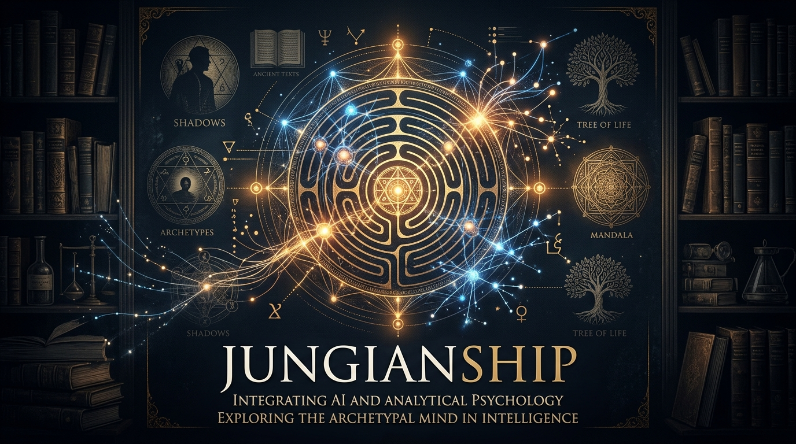

<div align="center">



<br/><br/>

# Jungianship

**Scholar-grade AI philosophical *companionship* — a companion grounded in the complete writings of Carl Gustav Jung.**

*Built to be adapted to any thinker, philosopher, or wise figure.*

[](https://www.python.org/)
[](https://aistudio.google.com/)
[](https://python-telegram-bot.org/)
[](https://www.sqlite.org/fts5.html)
[](LICENSE)

</div>

---

## What Is This?

Jungianship is a **Retrieval-Augmented Generation (RAG) Telegram bot** that speaks as — or about — a chosen intellectual persona. In its default configuration the bot embodies **Carl Gustav Jung**, answering existential questions, analyzing dreams, and defining analytical psychology concepts, all grounded in citations from his actual writings.


 **The architecture is fully persona-agnostic.** By changing five environment variables and swapping the corpus folder, the same codebase becomes a Marcus Aurelius, Nietzsche, Rumi, Dostoevsky, or Simone de Beauvoir companion.

---

## Features

| Feature | Detail |
|---|---|
| **Authentic voice** | Speaks in 1st person as the historical figure, or as a scholarly academic guide |
| **RAG-grounded answers** | Every response draws on retrieved passages from the indexed corpus |
| **Hybrid retrieval** | FTS5 (BM25) lexical search **+** Dense vector embeddings, fused via Reciprocal Rank Fusion (RRF) |
| **Dream analysis** | Archetypal / symbolic amplification of dreams (Jungian or adaptable method) |
| **Concept definitions** | Authoritative definitions drawn from the primary corpus |
| **Daily quotes** | Random aphorisms from a curated quotes database |
| **Conversation memory** | Per-user session history for multi-turn dialogue |
| **Mode switching** | Toggle between first-person persona and scholarly guide mid-conversation |
| **Source citations** | Every answer cites the specific volume and section it drew from |

---

## Architecture

```
┌─────────────────────────────────────────────────────────────┐
│                        Telegram User                        │
└──────────────────────────┬──────────────────────────────────┘
                           │  
                           ▼
┌─────────────────────────────────────────────────────────────┐
│                     Telegram Bot Layer                      │
│         python-telegram-bot v21 (async handlers)            │
│         HTML formatting · message splitting · inline KB     │
└──────────────────────────┬──────────────────────────────────┘
                           │
                           ▼
┌─────────────────────────────────────────────────────────────┐
│                  Dialectical Engine (RAG)                   │
│                                                             │
│   ┌─────────────────────────────────────────────────────┐   │
│   │              Hybrid Retriever                       │   │
│   │                                                     │   │
│   │   FTS5 BM25 Search  ──┐                             │   │
│   │                       ├── Reciprocal Rank Fusion ───┤   │
│   │   Dense Vector Search ─┘    (RRF, k=60)             │   │
│   │   (cosine sim, numpy)                               │   │
│   └─────────────────────────────────────────────────────┘   │
│                           │                                 │
│                    Top-K chunks + citations                  │
│                           │                                 │
│   ┌─────────────────────────────────────────────────────┐   │
│   │           Persona Prompt + RAG Context              │   │
│   │     (template-driven: any historical figure)        │   │
│   └─────────────────────────────────────────────────────┘   │
│                           │                                 │
│   ┌─────────────────────────────────────────────────────┐   │
│   │        Google Gemini (Generation Model)             │   │
│   │    gemini-3.7-flash · T=0.7 · 2048 max tokens      │   │
│   └─────────────────────────────────────────────────────┘   │
└─────────────────────────────────────────────────────────────┘
                           │
                           ▼
┌─────────────────────────────────────────────────────────────┐
│                    SQLite Database                          │
│                                                             │
│   documents   chunks   chunks_fts (FTS5)                    │
│   chat_history   user_sessions   quotes                     │
│                                                             │
│   Embeddings stored as binary blobs (float32, 3072-dim)     │
└─────────────────────────────────────────────────────────────┘
```

### Key Technical Decisions

**Why SQLite + FTS5?** Zero-infrastructure RAG. No vector database server, no Docker, no cloud setup. The full hybrid retrieval system runs in a single file on any machine with Python. FTS5 natively handles BM25 scoring and is battle-tested for millions of rows.

**Why Reciprocal Rank Fusion?** Lexical search (FTS5) excels at domain-specific jargon (*enantiodromia*, *numinosum*, *transcendent function*). Dense vector search excels at semantic similarity. RRF combines both ranked lists without needing to normalize scores across incompatible spaces — elegant and robust.

**Why Gemini Embeddings?** `gemini-embedding-001` produces 3072-dimensional embeddings with strong multilingual and domain understanding, well-suited to dense philosophical prose with technical vocabulary.

---

## Tech Stack

| Layer | Technology |
|---|---|
| Language | Python 3.11+ |
| Bot Framework | `python-telegram-bot` v21 (async) |
| Generation LLM | Google Gemini (`gemini-3.7-flash`) |
| Embeddings | Google Gemini (`gemini-embedding-001`, 3072-dim) |
| Storage | SQLite 3 with FTS5 virtual table |
| Vector ops | NumPy (in-memory cosine similarity matrix) |
| EPUB parsing | BeautifulSoup4 + `zipfile` (standard library) |
| Retrieval | Reciprocal Rank Fusion (BM25 + Dense) |
| Configuration | `python-dotenv` |

---

## Replication Guide (Step-by-Step)

### Prerequisites
- Python 3.11+
- A [Telegram Bot Token](https://core.telegram.org/bots/tutorial) (free, from @BotFather)
- A [Google Gemini API Key](https://aistudio.google.com/app/apikey) (free tier available)
- Legally-obtained EPUB texts of your chosen figure's works

### Step 1 — Clone & Install

```bash
git clone https://github.com/mojtabamahdy2-cloud/Jungianship.git
cd jungianship
pip install -r requirements.txt
```

### Step 2 — Configure

```bash
cp .env.example .env
```

Edit `.env` with your credentials and persona settings:

```env
TELEGRAM_BOT_TOKEN=your_telegram_bot_token_here
GEMINI_API_KEY=your_google_gemini_api_key_here

# Persona (change these for a different figure)
PERSONA_NAME=Carl Gustav Jung
PERSONA_ERA=1875–1961
PERSONA_ROLE=Swiss psychiatrist and founder of analytical psychology
PERSONA_WORKS=Collected Works, The Red Book, Memories Dreams Reflections
PERSONA_DOMAIN=analytical psychology, archetypes, the unconscious, individuation
```

### Step 3 — Source the Corpus

> [!IMPORTANT]
> The copyrighted source texts are **not included** in this repository. You must supply your own legally-obtained copies.

Place your EPUB files in a folder named `corpus/` at the project root:

```
jungianship/
└── corpus/
    ├── your_book_one.epub
    ├── your_book_two.epub
    └── ...
```


### Step 4 — Build the Index

```bash
# Index all EPUBs and generate vector embeddings (recommended)
python index_corpus.py --scope all --embed

# Index without embeddings (FTS5 only — faster, no API calls)
python index_corpus.py --scope all
```

This step:
1. Parses each EPUB, preserving chapter headings and paragraph numbering (`§`)
2. Chunks text into ~350-word overlapping windows
3. Saves all chunks to SQLite with BM25-indexed FTS5
4. Optionally generates 3072-dim Gemini embeddings per chunk

**Approximate indexing time:** ~2–5 min per 500-page book (without embedding); ~15–30 min with embedding (Gemini API rate-limited).

### Step 5 — Generate Embeddings (if not done above)

```bash
python embed_chunks.py
```

Run this separately if you indexed without `--embed` or want to add embeddings later.

### Step 6 — Run the Bot

```bash
python run_bot.py
```

Open Telegram, find your bot, and send `/start`.

---


## 🔄 Adapting to Any Wise Figure

The entire persona — prompts, welcome messages, metadata — is driven by five `.env` variables. No code changes required.

### Example: Marcus Aurelius

```env
PERSONA_NAME=Marcus Aurelius
PERSONA_ERA=121–180 CE
PERSONA_ROLE=Roman Emperor and Stoic philosopher
PERSONA_WORKS=Meditations, Correspondence with Fronto
PERSONA_DOMAIN=Stoic philosophy, virtue ethics, duty, impermanence, and self-discipline
CORPUS_DIR=corpus
```

Place EPUB/PDF editions of *Meditations* and related works in `corpus/`, run `index_corpus.py`, and you have a Marcus Aurelius companion.


## 📁 Project Structure

```
jungianship/
├── .env.example            # Template — copy to .env and fill in credentials
├── .gitignore
├── requirements.txt
├── run_bot.py              # Entry point
├── index_corpus.py         # Corpus ingestion pipeline
├── embed_chunks.py         # Standalone embedding generation
│
├── data/
│   ├── .gitkeep            # Directory tracked; .db files are gitignored
│   └── quotes.json         # Curated aphorisms with source citations
│
├── corpus/                 # ← Place your EPUB files here (gitignored)
│
├── src/
│   ├── config.py           # All configuration including PERSONA_* vars
│   ├── bot/
│   │   ├── handlers.py     # Telegram command handlers
│   │   ├── telegram_bot.py # Bot initialization and registration
│   │   └── ui_helpers.py   # HTML formatting, message splitting, keyboards
│   ├── db/
│   │   ├── database.py     # SQLite schema initialization
│   │   └── repository.py   # All database operations (CRUD, FTS, vector)
│   ├── engine/
│   │   ├── embedder.py     # Gemini embedding wrapper with batching + retry
│   │   ├── generator.py    # DialecticalEngine: RAG orchestration
│   │   ├── prompts.py      # Persona-driven system prompt templates
│   │   └── retriever.py    # HybridRetriever: FTS5 + Vector + RRF
│   └── ingestion/
│       ├── epub_parser.py  # EPUB text extraction with chapter/§ detection
│       └── chunker.py      # Sliding-window text chunker with overlap
│
└── tests/
    └── test_system.py      # Unit tests (metadata, FTS, history, UI helpers)
```

---

## 🧪 Running Tests

```bash
python -m unittest tests/test_system.py -v
```

Tests cover: metadata inference, FTS5 search, chat history, UI formatting, and the hybrid retriever.

---

## 📜 Copyright & Legal Notice

**This repository does not include any copyrighted texts.**

- The `corpus/` directory is excluded from version control via `.gitignore`.
- The `data/` SQLite database (containing embeddings derived from corpus texts) is also excluded.
- The quotes in `data/quotes.json` are widely-attributed aphorisms in the public domain and used here for educational and non-commercial purposes only.
- The persona does not pretend to be Jung (or any othre figure) claim to be affiliated, This project aims to help interested scholars gain knowledge in a more engaging role-play style.

All users are responsible for ensuring they have the legal right to use any texts they place in the `corpus/` folder. The project author makes no claim to any third-party intellectual property.

---

## Possible additions - Ideas

- Web interface (FastAPI + HTMX or Streamlit)
- Multi-persona support (switch figure mid-session)
- PDF corpus support (alongside EPUB)
- Per-user custom quotes upload
- Automated nightly quote delivery

---

## License

[MIT](LICENSE)
